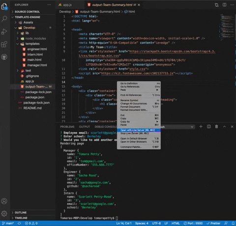

# Template Engine - Employee Summary
<a href="https://youtu.be/OKaovXvOLmM">Click here to see it in action.</a>

## Table of Contents
* [Description](#description)
* [Installation](#installation)
* [Usage](#usage)
* [License](#license)
* [Contributions](#contributions)
* [Tests](#tests)
* [Questions](#questions)

## Description 
*Overview of this project.* 
* This application is a command line application that takes user input and generates a list of cards with the team members' information. The application will prompt the user for information about the team manager and then information about the team members. The user can input any number of team members, and they may be a mix of engineers and interns. This assignment must also pass all unit tests. When the user has completed building the team, the application will create an HTML file that displays a nicely formatted team roster based on the information provided by the user. 

## Installation
*Steps required to install project and get the development environment established.*
* Simply enter `node app.js` to run the application. The application will prompt the user to enter information about the team. When all of the information has been entered the program will generate an HTML file. Go to output-Team-Summary.html and open in your browser to see the team that has been generated. 
* Type `npm run test` in your terminal to run tests using jest.

## Usage
*Instructions and examples for use:* 
* Use the Inquirer npm package to prompt the user for their email, id, and specific information based on their role with the company. For instance, an intern may provide their school, whereas an engineer may provide their GitHub username.
* <a href="https://youtu.be/OKaovXvOLmM">Click here to see a video of the application being used.</a>

## License 
* MIT

## Contributions
* Tomara Petty

## Test
* PASS - Employee.test.js
* PASS - Engineer.test.js
* PASS - Manager.test.js
* PASS - Intern.test.js

## Questions?

* If you have any questions please reach out to me here: 
* GitHub: @Tomararuth 
* Email: undefined
